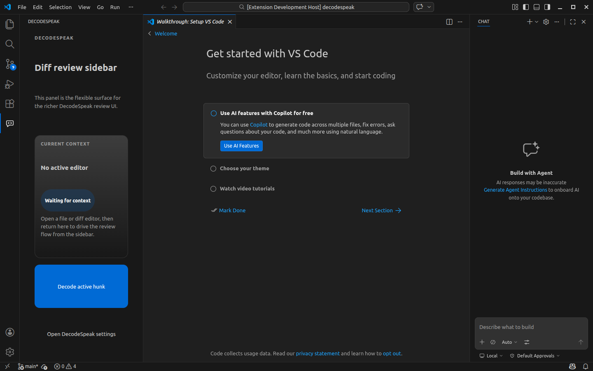
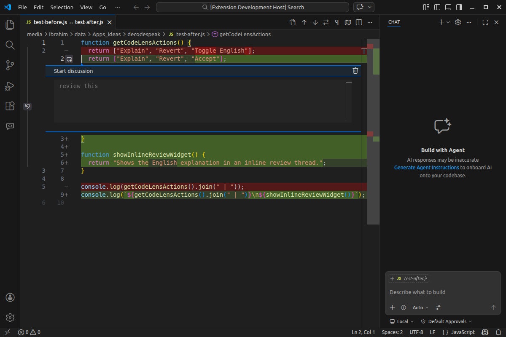

# DecodeSpeak

DecodeSpeak is a VS Code extension prototype that explains diff hunks in plain English.

It keeps lightweight actions in the diff editor and uses a dedicated sidebar for a richer review flow.

## Status

This project is early-stage and open for contributions.

What works today:
- active diff detection on the modified side of a text diff
- per-hunk CodeLens actions: `Explain`, `Accept`, `Revert`
- a DecodeSpeak sidebar in the Activity Bar
- local explanation calls through `codex exec`
- explanation caching per hunk
- a native inline review composer for the current diff flow

What is still rough:
- `Revert` is still a placeholder
- the richer review UX is moving toward the sidebar
- there is no packaged marketplace release yet

## Screenshots

### Sidebar surface



### Diff review flow



## How it works

1. Open a diff editor in VS Code
2. Put the cursor on a changed hunk
3. Trigger `Explain` from CodeLens or use the DecodeSpeak sidebar
4. DecodeSpeak gathers the current hunk context and calls the local `codex` CLI

## Requirements

- VS Code `^1.96.0`
- Node.js and `npm`
- local `codex` CLI available on your path, or configured through `decodespeak.codexCliPath`

## Commands

- `DecodeSpeak: Explain Active Diff Hunk`
- `DecodeSpeak: Accept Active Diff Hunk`
- `DecodeSpeak: Revert Active Diff Hunk`
- `DecodeSpeak: Focus Sidebar`

## Development

Install dependencies and run the checks:

```bash
npm install
npm run build
npm run test
```

Launch a dedicated Extension Development Host:

```bash
code --new-window \
  --extensionDevelopmentPath="$PWD" \
  "$PWD"
```

Open the sample diff quickly:

```bash
code --new-window \
  --extensionDevelopmentPath="$PWD" \
  --diff "$PWD/test-before.js" "$PWD/test-after.js"
```

## Configuration

- `decodespeak.codexCliPath`: path to the `codex` executable
- `decodespeak.codexModel`: optional model override
- `decodespeak.requestTimeoutMs`: CLI timeout in milliseconds
- `decodespeak.contextLines`: modified-side context lines around the hunk

## Roadmap

- move the richer review workflow into the sidebar
- make `Revert` a real per-hunk action
- improve sidebar-to-diff synchronization
- add stronger integration and end-to-end test coverage
- publish a marketplace-ready release

## Contributing

See `CONTRIBUTING.md`.

## License

MIT. See `LICENSE`.
